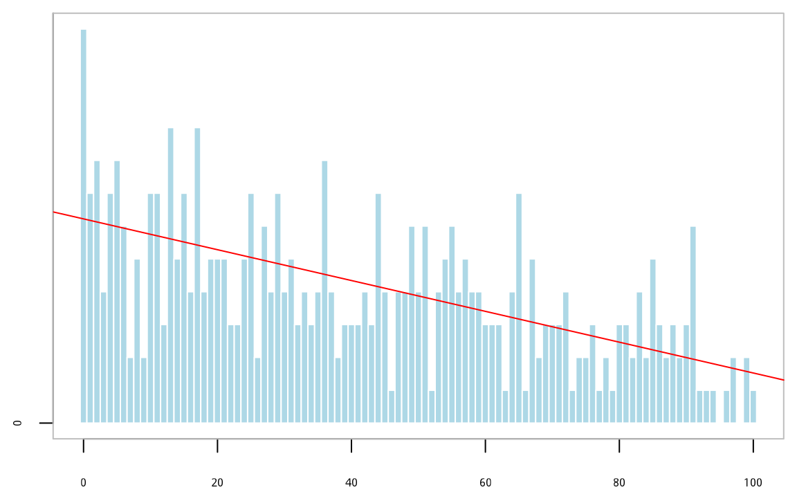
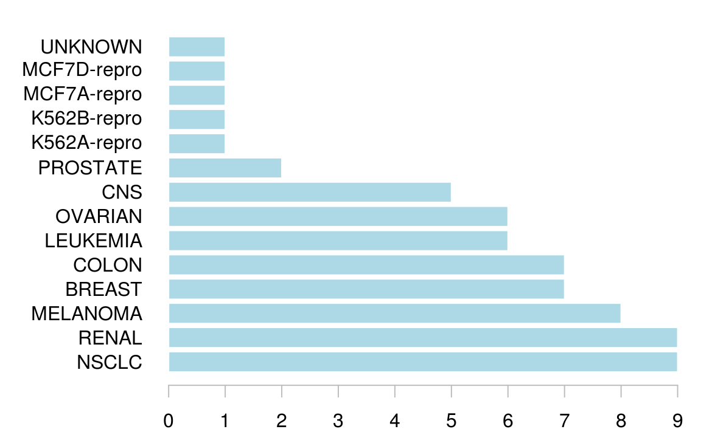
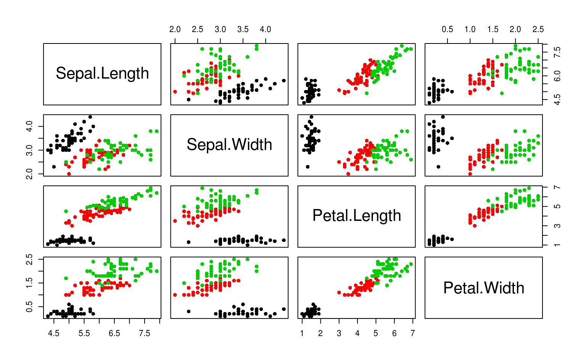
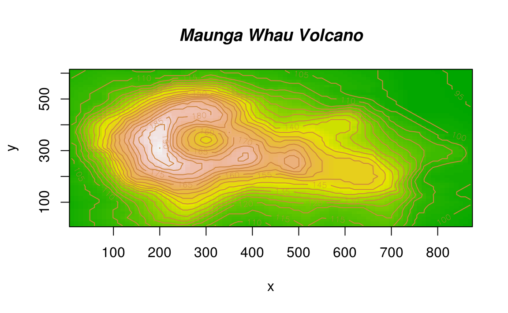
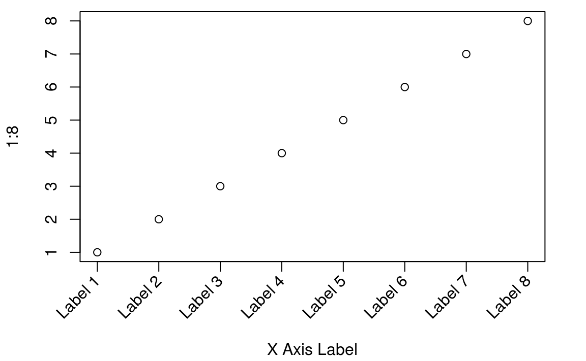

# 基础图形 {#graphics}


## plot {#base}


```r
set.seed(2018) 
n <- 2^16
x <- runif(n,0,1)
delta <- 0.01
len <- diff(c(0,which(x < delta),n+1))-1
ylim <- seq( 0, 1800, by = 300)
xlim <- seq( 0, 100, by = 20)
p <- hist(len[len < 101], breaks = -1:100+0.5, plot = FALSE)
par(mar = c(2,2,.5,.5))
plot(p, xlab = '间距', ylab = '频数', axes = FALSE, 
     col = "lightblue", border = "white", main = "")	 
axis( 1, labels = xlim, at = xlim, las = 1) # x 轴
axis( 2, labels = ylim, at = ylim, las = 0) # y 轴
box(col="gray")
# 添加线性回归线
xx <- seq.int(from = 0, to = 100, by = 1)
xy <- p$counts
options(digits = 2)
fit <- lm(xy~xx)
abline(fit, col = 'red')
```

<div class="figure" style="text-align: center">

<p class="caption">(\#fig:run-length-hist)游程直方图</p>
</div>

```r
b = coef(fit)
# mtext(paste0( "Y = ", paste0(paste0(b[1], b[2]),"x") ), side = 3, cex = 2)
```

还你一个清爽的世界，统计之都文章 [漫谈条形图](https://cosx.org/2017/10/discussion-about-bar-graph/)


```r
data(NCI60, package = "ISLR") # 加载数据
myData <- sort(table(NCI60$labs), decreasing = TRUE)
par(mar = c(2, 7, 1, 1))
barCenters <- barplot(myData,
  col = "lightblue", axes = FALSE,
  axisnames = FALSE, horiz = TRUE, border = "white"
)
text(
  y = barCenters, x = par("usr")[3],
  adj = 1, labels = names(myData), xpd = TRUE
)
axis(1, labels = seq(0, 9, by = 1), at = seq(0, 9, by = 1), las = 1, col = "gray")
```

<div class="figure" style="text-align: center">

<p class="caption">(\#fig:beautiful-barplot)条形图</p>
</div>

plot 作为一个泛型函数，对于不同的输入数据类型，会自动匹配不同的绘图函数，默认的有


```r
methods(plot)
#>  [1] plot.acf*           plot.data.frame*    plot.decomposed.ts*
#>  [4] plot.default        plot.dendrogram*    plot.density*      
#>  [7] plot.ecdf           plot.factor*        plot.formula*      
#> [10] plot.function       plot.hclust*        plot.histogram*    
#> [13] plot.HoltWinters*   plot.isoreg*        plot.lm*           
#> [16] plot.medpolish*     plot.mlm*           plot.numpy.ndarray*
#> [19] plot.ppr*           plot.prcomp*        plot.princomp*     
#> [22] plot.profile.nls*   plot.raster*        plot.shingle*      
#> [25] plot.spec*          plot.stepfun        plot.stl*          
#> [28] plot.table*         plot.trellis*       plot.ts            
#> [31] plot.tskernel*      plot.TukeyHSD*     
#> see '?methods' for accessing help and source code
```


```r
op <- par(mfrow = c(3, 2), mar = c(2, 2, .5, .5))
# 分类散点图
plot(Sepal.Length ~ Sepal.Width, data = iris, col = Species, pch = 16)
legend("topright",
  legend = unique(iris$Species), box.col = "gray",
  pch = 16, col = unique(iris$Species)
)
box(col = "gray")
# 气泡图
plot(Volume ~ Height,
  data = trees, pch = 16, cex = Girth / 8,
  col = rev(terrain.colors(nrow(trees), alpha = .5))
)
box(col = "gray")
# 折线图
plot(AirPassengers, col = "lightblue")
box(col = "gray")

# 柱形图
set.seed(123456)
barPois <- table(stats::rpois(1000, lambda = 5))
plot(barPois, col = "lightblue", type = "h", lwd = 10, main = "")
box(col = "gray")

# 马赛克图
# par(mar=c(2,2,.5,.5))
plot(HairEyeColor, col = "lightblue", border = "white", main = "")
# box(col="gray")
# 矩阵图 自带 layout
plot(iris[, -5], col = iris$Species, pch = 16)
```

<div class="figure" style="text-align: center">

<p class="caption">(\#fig:nice-plot)丰富的方法</p>
</div><div class="figure" style="text-align: center">

<p class="caption">(\#fig:nice-plot)丰富的方法</p>
</div>

```r
par(op)
```

raster 图形


```r
library(raster)
#> Loading required package: sp
#> 
#> Attaching package: 'raster'
#> The following object is masked from 'package:magrittr':
#> 
#>     extract
library(sp)
library(spDataLarge)
plot(elevation, asp = NA)
```

<div class="figure" style="text-align: center">

<p class="caption">(\#fig:unnamed-chunk-4)raster 图形</p>
</div>

注意与 image 函数区别


```r
# A prettier display of the volcano
x <- 10*(1:nrow(volcano))
y <- 10*(1:ncol(volcano))
image(x, y, volcano, col = terrain.colors(100), axes = FALSE)
contour(x, y, volcano, levels = seq(90, 200, by = 5),
        add = TRUE, col = "peru")
axis(1, at = seq(100, 800, by = 100))
axis(2, at = seq(100, 600, by = 100))
box()
title(main = "Maunga Whau Volcano", font.main = 4)
```

<div class="figure" style="text-align: center">

<p class="caption">(\#fig:unnamed-chunk-5)image 图形</p>
</div>

残差图

```
# iris$Species 分三类

vec_mean <- apply(iris[,-5],2,mean)
vec_sd <- apply(iris[,-5],2,sd)

plot( seq(4) , vec_mean,
    ylim = range(c(vec_mean-vec_sd, vec_mean + vec_sd)),
    pch=19, xlab="Species", ylab="Mean +/- SD",
    main="Scatter plot with std.dev error bars"
)

arrows(seq(4), vec_mean-vec_sd, seq(4),  vec_mean + vec_sd, length=0.05, angle=90, code=3)
# seq( nlevels(iris$Species) )
```


所谓高级就是一个 `plot` 就可以画出一幅图，它包括标题，坐标轴标签等等 [@R-intro]

我们先来看看 **graphics** 包提供的绘图函数， 绘图功能使用手册， 如添加参考线、 标题、 标签和旋转轴标签等等


```r
library(graphics)
ls("package:graphics")
#>  [1] "abline"          "arrows"          "assocplot"      
#>  [4] "axis"            "Axis"            "axis.Date"      
#>  [7] "axis.POSIXct"    "axTicks"         "barplot"        
#> [10] "barplot.default" "box"             "boxplot"        
#> [13] "boxplot.default" "boxplot.matrix"  "bxp"            
#> [16] "cdplot"          "clip"            "close.screen"   
#> [19] "co.intervals"    "contour"         "contour.default"
#> [22] "coplot"          "curve"           "dotchart"       
#> [25] "erase.screen"    "filled.contour"  "fourfoldplot"   
#> [28] "frame"           "grconvertX"      "grconvertY"     
#> [31] "grid"            "hist"            "hist.default"   
#> [34] "identify"        "image"           "image.default"  
#> [37] "layout"          "layout.show"     "lcm"            
#> [40] "legend"          "lines"           "lines.default"  
#> [43] "locator"         "matlines"        "matplot"        
#> [46] "matpoints"       "mosaicplot"      "mtext"          
#> [49] "pairs"           "pairs.default"   "panel.smooth"   
#> [52] "par"             "persp"           "pie"            
#> [55] "plot"            "plot.default"    "plot.design"    
#> [58] "plot.function"   "plot.new"        "plot.window"    
#> [61] "plot.xy"         "points"          "points.default" 
#> [64] "polygon"         "polypath"        "rasterImage"    
#> [67] "rect"            "rug"             "screen"         
#> [70] "segments"        "smoothScatter"   "spineplot"      
#> [73] "split.screen"    "stars"           "stem"           
#> [76] "strheight"       "stripchart"      "strwidth"       
#> [79] "sunflowerplot"   "symbols"         "text"           
#> [82] "text.default"    "title"           "xinch"          
#> [85] "xspline"         "xyinch"          "yinch"
```

## 添加矩形网格线 {#rectangular-grid}

矩形网格线是用做背景参考线的，常常是淡灰色的细密虚线，`plot` 函数的 `panel.first` 参数^[确切的说是 `plot.default` 函数] 和 `grid` 函数


```r
# 抄自 https://yihui.name/cn/2018/02/cohen-s-d/
n = 30  # 样本量（只是一个例子）
x = seq(0, 12, 0.01)
par(mar = c(4, 4, 0.2, 0.1))
plot(x/sqrt(n), 2 * (1 - pt(x, n - 1)), xlab = "d = t / sqrt(n)", 
  type = "l", panel.first = grid())
abline(v = c(0.01, 0.2, 0.5, 0.8, 1.2, 2), lty = 2)
```

<div class="figure" style="text-align: center">

<p class="caption">(\#fig:panel-first)添加背景参考线</p>
</div>

## 旋转坐标抽标签 {#rotated-axis-labels}

旋转坐标抽标签的例子来自手册《R FAQ》的第7章第27个问题 [@R-FAQ]，在基础图形中，旋转坐标轴标签需要 `text()` 而不是 `mtext()`，因为后者不支持`par("srt")` 


```r
## Increase bottom margin to make room for rotated labels
par(mar = c(5, 4, .5, 2) + 0.1)
## Create plot with no x axis and no x axis label
plot(1 : 8, xaxt = "n",  xlab = "")
## Set up x axis with tick marks alone
axis(1, labels = FALSE)
## Create some text labels
labels <- paste("Label", 1:8, sep = " ")
## Plot x axis labels at default tick marks
text(1:8, par("usr")[3] - 0.5, srt = 45, adj = 1,
     labels = labels, xpd = TRUE)
## Plot x axis label at line 6 (of 7)
mtext(side = 1, text = "X Axis Label", line = 4)
```

<div class="figure" style="text-align: center">

<p class="caption">(\#fig:rotate-axis-labels)旋转坐标轴标签</p>
</div>

`srt = 45` 表示文本旋转角度， `xpd = TRUE` 允许文本越出绘图区域，`adj = 1` to place the right end of text at the tick marks；You can adjust the value of the 0.5 offset as required to move the axis labels up or down relative to the x axis.


## 添加数学注释 {#math-annotation}

数学符号注释，图\@ref(fig:math-annotation) 自定义坐标轴 [@Paul2000]。


```r
# 抄自 https://www.tandfonline.com/doi/pdf/10.1080/10618600.2000.10474900
par(mar = c(4, 4, 0.2, 0.1))
plot(c(1, 1e6), c(-pi, pi), type = "n", 
     axes = FALSE, ann = FALSE, log = "x")
axis(1, at = c(1, 1e2, 1e4, 1e6), 
     labels = expression(1, 10^2, 10^4, 10^6))
axis(2, at = c(-pi, -pi / 2, 0, pi / 2, pi), 
     labels = expression(-pi, -pi / 2, 0, pi / 2, pi))
text(1e3, 0, expression(italic("Customized Axes")))
box()
```

<div class="figure" style="text-align: center">

<p class="caption">(\#fig:math-annotation)在自定义的坐标轴上添加合适的数学注释</p>
</div>


## 标记特定的数据 {#label-points}

散点图上，我们常常需要标记一些点


```r
par(mar = c(4, 4, 0.2, 0.1))
# 抄自 StackOverflow  https://stackoverflow.com/questions/51804892
data("iris")
stripchart(Petal.Length ~ Species, data = iris, subset = Petal.Length > 1.4,
   vertical = TRUE, method = "jitter", ylim = c(1,7), 
   pch = 16)
stripchart(Petal.Length ~ Species, data = iris, subset = Petal.Length < 1.4,
   vertical = TRUE, method = "jitter", add = TRUE, col = "red",
   pch = 17)
```

<div class="figure" style="text-align: center">

<p class="caption">(\#fig:label-data)用红色实心三角标记数据</p>
</div>

`stripchart` 函数本质上还是 `plot` 函数^[获取源代码 `getAnywhere(stripchart.default)` ]


## 文本越出绘图区域

<!-- https://lcolladotor.github.io/2014/11/21/add-logo-in-R -->


## 抖动图

抖动散点图


```r
mat <- matrix(1:length(colors()), ncol = 9, byrow= TRUE)
df <- data.frame(col = colors(), 
	x = as.integer(cut(1:length(colors()), 9)),
	y = rep(1:73, 9), stringsAsFactors=FALSE)
par(mar = c(4, 4, 1, 0.1))
plot(y ~ jitter(x), data = df, col = df$col,
 	pch=16, main = "Visualizing colors() split in 9 groups",
 	xlab = "Group", 
	ylab = "Element of the group (min = 1, max = 73)",
	sub = "x = 3, y = 1 means that it's the 2 * 73 + 1 = 147th color")
```

<div class="figure" style="text-align: center">

<p class="caption">(\#fig:jitter-scatter)抖动散点图</p>
</div>
