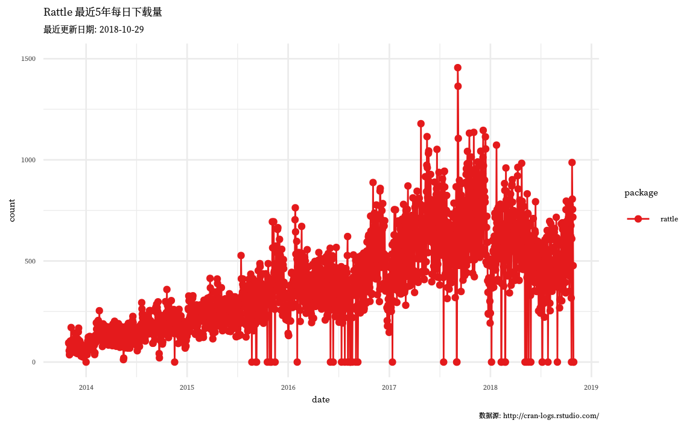
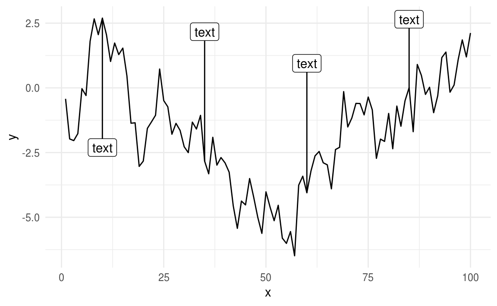

# 高级图形 {#ggplot}


- Claus O. Wilke 新书：数据可视化基础 [Fundamentals of Data Visualization](http://serialmentor.com/dataviz/) 全 R/ggplot2 实现


ggplot2 有很多绘图函数


```r
library(ggplot2)
# packageDescription("ggplot2")
grep('^(geom_)', ls('package:ggplot2'), value = TRUE)
#>  [1] "geom_abline"     "geom_area"       "geom_bar"       
#>  [4] "geom_bin2d"      "geom_blank"      "geom_boxplot"   
#>  [7] "geom_col"        "geom_contour"    "geom_count"     
#> [10] "geom_crossbar"   "geom_curve"      "geom_density"   
#> [13] "geom_density_2d" "geom_density2d"  "geom_dotplot"   
#> [16] "geom_errorbar"   "geom_errorbarh"  "geom_freqpoly"  
#> [19] "geom_hex"        "geom_histogram"  "geom_hline"     
#> [22] "geom_jitter"     "geom_label"      "geom_line"      
#> [25] "geom_linerange"  "geom_map"        "geom_path"      
#> [28] "geom_point"      "geom_pointrange" "geom_polygon"   
#> [31] "geom_qq"         "geom_qq_line"    "geom_quantile"  
#> [34] "geom_raster"     "geom_rect"       "geom_ribbon"    
#> [37] "geom_rug"        "geom_segment"    "geom_sf"        
#> [40] "geom_sf_label"   "geom_sf_text"    "geom_smooth"    
#> [43] "geom_spoke"      "geom_step"       "geom_text"      
#> [46] "geom_tile"       "geom_violin"     "geom_vline"
grep('^(stat_)', ls('package:ggplot2'), value = TRUE)
#>  [1] "stat_bin"            "stat_bin_2d"         "stat_bin_hex"       
#>  [4] "stat_bin2d"          "stat_binhex"         "stat_boxplot"       
#>  [7] "stat_contour"        "stat_count"          "stat_density"       
#> [10] "stat_density_2d"     "stat_density2d"      "stat_ecdf"          
#> [13] "stat_ellipse"        "stat_function"       "stat_identity"      
#> [16] "stat_qq"             "stat_qq_line"        "stat_quantile"      
#> [19] "stat_sf"             "stat_sf_coordinates" "stat_smooth"        
#> [22] "stat_spoke"          "stat_sum"            "stat_summary"       
#> [25] "stat_summary_2d"     "stat_summary_bin"    "stat_summary_hex"   
#> [28] "stat_summary2d"      "stat_unique"         "stat_ydensity"
```

rattle 下载量时序图


```r
library(cranlogs)
library(ggthemes)
pkgs_down <- cran_downloads(package = "rattle", from = Sys.Date() - 365 * 5, to = Sys.Date())
ggplot(pkgs_down, aes(x = date, y = count, colour = package)) +
  geom_line() +
  geom_point(size = 1.5) +
  scale_x_date(date_breaks = "1 year", date_labels = "%Y") +
  ylim(c(0, 1500)) +
  scale_colour_brewer(palette = "Set1") +
  # scale_color_fivethirtyeight("") +
  # theme_fivethirtyeight() +
  labs(
    subtitle = paste("最近更新日期:", Sys.Date()),
    title = "Rattle 最近5年每日下载量",
    caption = " 数据源: http://cran-logs.rstudio.com/ "
  ) +
  theme_minimal(base_size = 10.54, base_family = "source-han-serif-cn")
```



给线条添加注释和标签，这个功能有时候比图例更加漂亮


```r
# 出自 https://gist.github.com/EmilHvitfeldt/acb849a6135a21426c260850cf0f461b
# Horizontal annotations with ggrepel and ggplot2
library(tidyverse)
#> ── Attaching packages ────────────────────────────────── tidyverse 1.2.1 ──
#> ✔ tibble  1.4.2     ✔ purrr   0.2.5
#> ✔ tidyr   0.8.2     ✔ dplyr   0.7.7
#> ✔ readr   1.1.1     ✔ stringr 1.3.1
#> ✔ tibble  1.4.2     ✔ forcats 0.3.0
#> ── Conflicts ───────────────────────────────────── tidyverse_conflicts() ──
#> ✖ tidyr::extract()   masks magrittr::extract()
#> ✖ dplyr::filter()    masks stats::filter()
#> ✖ dplyr::lag()       masks stats::lag()
#> ✖ purrr::set_names() masks magrittr::set_names()
library(ggrepel)
data <- tibble(
  x = seq_len(100),
  y = cumsum(rnorm(100))
)

anno_data <- data %>%
  filter(x %% 25 == 10) %>%
  mutate(text = "text")

data %>%
  ggplot(aes(x, y)) +
  geom_line() +
  geom_label_repel(aes(label = text),
    data = anno_data,
    direction = "y",
    nudge_y = c(-5, 5, 5, 5)
  ) +
  theme_minimal()
```

<div class="figure" style="text-align: center">

<p class="caption">(\#fig:add-label-ggrepel)添加标签</p>
</div>


为什么是 Grid Lattice 而不是 Trellis


```

If you imagine that this pen is Trellis, then Lattice is not this pen.
   -- Paul Murrell (on the difference of Lattice (which eventually was
      called grid) and Trellis)
      DSC 2001, Wien (March 2001)
```


令人非常沮丧的是，很难用


```

Trellis graphics are a bit like hash functions: you can be close to the
target, but get a far-off result.
   -- Dieter Menne (about problems with creating a suitable lattice panel
      function)
      R-help (August 2008)
```
