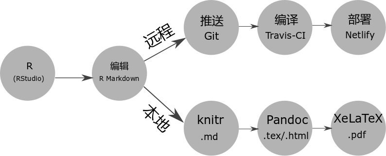

# R Markdown {#chap:R-Markdown}

```{r include=FALSE}
Pkgs <- c(
  "kableExtra"
)
if (length(setdiff(Pkgs, .packages(TRUE))) > 0)
  install.packages(setdiff(Pkgs, .packages(TRUE)))
```

R Markdown 站在巨人的肩膀上，这些巨人有 [Markdown](https://daringfireball.net/projects/markdown/)、 [LaTeX](https://www.latex-project.org/)、 [Pandoc](http://pandoc.org)。 

生态系统

1. 报告
   - learnr: Interactive Tutorials with R Markdown <https://rstudio.github.com/learnr/>
   - r2d3: R Interface to D3 Visualizations <https://rstudio.github.io/r2d3/>
   - radix: Radix combines the technical authoring features of Distill with R Markdown, enabling a fully reproducible workflow based on literate programming <https://github.com/radixpub/radix-r>
2. 网络服务
   - RestRserve: RestRserve is a R web API framework for building high-performance microservices and app backends <https://github.com/dselivanov/RestRserve> 基于 [Rserve](https://github.com/s-u/Rserve) 在笔记本上处理请求的吞吐量是每秒10000次，比 plumber 快大约20倍
   - plumber: Turn your R code into a web API. <https://www.rplumber.io>
3. 展示
   - revealjs: R Markdown Format for reveal.js Presentations <https://github.com/rstudio/revealjs>
   - xaringan: Presentation Ninja 幻灯忍者写轮眼 <https://slides.yihui.name/xaringan/>

## bookdown

```{asis}
> A Markdown-formatted document should be publishable as-is, as plain text, without looking like it’s been marked up with tags or formatting instructions. --- John Gruber
```

Markdown 基础语法见 RStudio IDE自带的手册 Markdown Quick Reference， 这里主要介绍一下 Markdown 高级语法， 特别是 Pandoc's Markdown^[Pandoc 提供了很多对 Markdown 的扩展支持] 表格、图片和公式的使用

- 表格

插入表格很简单的，如表 \@ref(tab:insert-tab) 所示，还带脚注哦

Table: (\#tab:insert-tab) A table caption^[With a footnote]

| First Header | Second Header |
| :----------- | :------------ |
| Content Cell | Content Cell  |
| Content Cell | Content Cell  |


- 图片

插入图片也很简单的，如图\@ref(fig:insert-fig)所示

```{asis}
<div align="center">
![插入图^[这里也是脚注哦]](figures/fig11.png){#fig:insert-fig width=45% }
</div>
```

图、表的标题很长可以使用文本引用^[<https://bookdown.org/yihui/bookdown/markdown-extensions-by-bookdown.html#text-references>]的方式实现。

```{r knitr-graphics, fig.cap="(ref:par)",out.width="45%",echo=FALSE}
knitr::include_graphics(path = "figures/fig11.png")
```

(ref:par) 图表标题很长可使用文本引用方式 `knitr::include_graphics` 插图


- 引用

为了区分章和节之间的引用，在章的添加 chap，如 `\@ref(chap:R-Markdown)`，在节的添加 sect，如 `\@ref(sect:markdown)`

(ref:fig-cap) 测试文本引用 \@ref(chap:R-Markdown)

```{r 'fig1', fig.cap='(ref:fig-cap)'}
plot( rnorm( 10 ) )
```

```{r 'fig2', fig.cap='(ref:fig-cap)', fig.height=2, out.height='4in'}
plot( rnorm( 10 ) )
```


- 公式

行内公式一对美元符号 $\alpha$ 或者 \(\alpha+\beta\)，行间公式 $$\alpha$$ 或者 \[\alpha + \beta\]

对公式编号，如公式 \@ref(eq:likelihood)

\begin{equation}
L(\beta,\boldsymbol{\theta}) = f(y;\beta,\boldsymbol{\theta}) = \int_{\mathbb{R}^{n}}N(t;D\beta,\Sigma(\boldsymbol{\theta}))f(y|t)dt (\#eq:likelihood)
\end{equation}

多行公式分别编号，如公式\@ref(eq:BL-SGLMM) 和公式\@ref(eq:Poss-SGLMM) 

\begin{align}
\log\{\frac{p_i}{1-p_i}\} & = T_{i} = d(x_i)'\beta + S(x_i) + Z_i (\#eq:BL-SGLMM)\\
\log(\lambda_i)           & = T_{i} = d(x_i)'\beta + S(x_i) + Z_i (\#eq:Poss-SGLMM)
\end{align}

多行公式中对某一（些）行编号，如公式 \@ref(eq:align) 和 公式 \@ref(eq:Poss-SGLMM2)

\begin{align} 
g(X_{n}) &= g(\theta)+g'({\tilde{\theta}})(X_{n}-\theta) \\
\sqrt{n}[g(X_{n})-g(\theta)] &= g'\left({\tilde{\theta}}\right) 
  \sqrt{n}[X_{n}-\theta ] (\#eq:align) \\
\log(\lambda_i)  & = T_{i} = d(x_i)'\beta + S(x_i) + Z_i (\#eq:Poss-SGLMM2)  
\end{align} 

多行公式共用一个编号，如公式 \@ref(eq:likelihood2)

\begin{equation}
\begin{aligned}
L(\beta,\boldsymbol{\theta})
& = \int_{\mathbb{R}^{n}} \frac{N(t;D\beta,\Sigma(\boldsymbol{\theta}))f(y|t)}{N(t;D\beta_{0},\Sigma(\boldsymbol{\theta}_{0}))f(y|t)}f(y,t)dt\\
& \varpropto \int_{\mathbb{R}^{n}} \frac{N(t;D\beta,\Sigma(\boldsymbol{\theta}))}{N(t;D\beta_{0},\Sigma(\boldsymbol{\theta}_{0}))}f(t|y)dt \\
&= E_{T|y}\left[\frac{N(t;D\beta,\Sigma(\boldsymbol{\theta}))}{N(t;D\beta_{0},\Sigma(\boldsymbol{\theta}_{0}))}\right] 
\end{aligned}
(\#eq:likelihood2)
\end{equation}

推荐在 `equation` 公式中，使用 `split` 环境，意思是一个公式很长，需要拆成多行，如公式\@ref(eq:var-beta)

\begin{equation} 
\begin{split}
\mathrm{Var}(\hat{\beta}) & =\mathrm{Var}((X'X)^{-1}X'y)\\
 & =(X'X)^{-1}X'\mathrm{Var}(y)((X'X)^{-1}X')'\\
 & =(X'X)^{-1}X'\mathrm{Var}(y)X(X'X)^{-1}\\
 & =(X'X)^{-1}X'\sigma^{2}IX(X'X)^{-1}\\
 & =(X'X)^{-1}\sigma^{2}
\end{split}
(\#eq:var-beta)
\end{equation} 

注意，`\mathbf` 只对字母 $a,b,c,A,B,C$ 加粗，mathjax 不支持公式中使用 `\bm` 对 $\theta,\alpha,\beta,\ldots,\gamma$ 加粗，应该使用 `\boldsymbol`


- 图片引用

`r if(knitr::is_latex_output()) "如图 \\@ref(fig:id1) 所示"`

{#fig:id1 width=70% }

gitbook 这样网页又该如何引用这张图片呢？

```{r 00-workflow, echo = FALSE, fig.cap="两种编译方式及过程"}
ext <- if (knitr::is_html_output()) ".svg" else if (knitr::is_latex_output()) ".pdf" else ".png"
knitr::include_graphics(path = paste0("diagrams/00-workflow", ext))
```

如图 \@ref(fig:00-workflow) 展示了两种编译方式


在指定目录创建 Book 项目，

```r
bookdown:::bookdown_skeleton("~/book")
```

项目根目录的文件列表

```markdown
directory/
├──  index.Rmd
├── 01-intro.Rmd
├── 02-literature.Rmd
├── 03-method.Rmd
├── 04-application.Rmd
├── 05-summary.Rmd
├── 06-references.Rmd
├── _bookdown.yml
├── _output.yml
├──  book.bib
├──  preamble.tex
├──  README.md
└──  style.css
```

broom 和 pixiedust 制作表格 Tables So Beautifully Fine-Tuned You Will Believe It's Magic. <https://github.com/nutterb/pixiedust>


## 复杂表格制作 {#kableExtra}

- kableExtra

借助 kableExtra 包 [@R-kableExtra] 可以制作复杂的统计图表，更多的例子请看 <https://github.com/haozhu233/kableExtra> ，我喜欢这个图标设计，如图 \@ref(fig:kableExtra)

```{r kableExtra, echo = FALSE, fig.cap="kableExtra 的徽标",out.width="30%"}
ext <- if (knitr::is_html_output()) ".svg" else if (knitr::is_latex_output()) ".pdf" else ".png"
knitr::include_graphics(path = paste0("diagrams/kableExtra", ext))
```

```{r, eval = FALSE}
library(knitr)
library(kableExtra)
dt <- mtcars[1:5, 1:4]

# HTML table
kable(dt, format = "html", caption = "kableExtra 制作") %>%
  kable_styling(bootstrap_options = "striped",
                full_width = F) %>%
  add_header_above(c(" ", "Group 1" = 2, "Group 2[note]" = 2)) %>%
  add_footnote(c("table footnote"))

# LaTeX Table
kable(dt, format = "latex", booktabs = T, caption = "kableExtra 制作") %>%
  kable_styling(latex_options = c("striped", "hold_position"),
                full_width = F) %>%
  add_header_above(c(" ", "Group 1" = 2, "Group 2[note]" = 2)) %>%
  add_footnote(c("table footnote"))
```

1. 如何将表格横向或者纵向展示


2. 添加短标题

```{r, eval=FALSE}
library(dplyr)
library(knitr)
library(kableExtra) # 这个必须加载

df <- data.frame( X = sample(letters, 10), y = runif(10), z = sample(10:20, 10))

kable(df,
      booktabs = TRUE,
      caption = "This caption is way too long and doesnt look good when formatted in the Table of Contents.  What you really need here is a much shorter caption so that your eyes dont go crazy trying to figure out what information the author is trying to convey.  Often there is too much information in the caption anyway so why not shorten it?.",
      escape = FALSE,
      format = 'latex') %>%
  kable_styling(latex_options = c("striped", "hold_position"))
```


```{r, eval=FALSE}
kable(df,
      booktabs = TRUE,
      caption = "This caption is way too long and doesnt look good when formatted in the Table of Contents.  What you really need here is a much shorter caption so that your eyes dont go crazy trying to figure out what information the author is trying to convey.  Often there is too much information in the caption anyway so why not shorten it?.",
      caption.short = "This is a shorter caption.",
      escape = FALSE,
      format = 'latex') %>%
  kable_styling(latex_options = c("striped", "hold_position"))
```

## 那些年遇到的有关字符编码的坑

- Windows

```bash
l10n_info()
```
```
$`MBCS`
[1] TRUE

$`UTF-8`
[1] FALSE

$`Latin-1`
[1] FALSE

$codepage
[1] 936
```

```
localeToCharset()
[1] "CP936"
```

- Linux

```r
l10n_info()
```
```
$MBCS
[1] TRUE

$`UTF-8`
[1] TRUE

$`Latin-1`
[1] FALSE
```

```
localeToCharset()
[1] "UTF-8" NA  
```

## 文件管理

- sys: Powerful replacements for base::system2 <https://github.com/jeroen/sys>
- fs: Provide cross platform file operations based on libuv <http://fs.r-lib.org/>

- 文件压缩*解压缩

`tar/untar` 与 `zip/unzip`

- 文件读写

```r
apropos("^read.")
```
```
 [1] "read.csv"         "read.csv2"        "read.dcf"        
 [4] "read.delim"       "read.delim2"      "read.DIF"        
 [7] "read.fortran"     "read.ftable"      "read.fwf"        
[10] "read.socket"      "read.table"       "readBin"         
[13] "readChar"         "readCitationFile" "readClipboard"   
[16] "readline"         "readLines"        "readRDS"         
[19] "readRegistry"     "readRenviron"    
```

```r
apropos("^write.")
```

```
 [1] "write.csv"      "write.csv2"     "write.dcf"      "write.ftable"  
 [5] "write.socket"   "write.table"    "writeBin"       "writeChar"     
 [9] "writeClipboard" "writeLines"    
```

- 文件创建/删改查

```r
apropos("^file.")
```
```
 [1] "file.access"  "file.append"  "file.choose"  "file.copy"   
 [5] "file.create"  "file.edit"    "file.exists"  "file.info"   
 [9] "file.link"    "file.mode"    "file.mtime"   "file.path"   
[13] "file.remove"  "file.rename"  "file.show"    "file.size"   
[17] "file.symlink" "file_test"    "fileSnapshot"
```

`choose.files`  `list.files`

- 下载文件

```r
apropos("^download.")
```
```
[1] "download.file"     "download.packages"
```

- 目录操作

```r
apropos("dir.")
```
```
[1] "dir.create"       "dir.exists"       "dirname"         
[4] "getSrcDirectory"  "list.dirs"        "substituteDirect"
```

`capture.output` 参数为表达式

`with` 与 `attach`
`sink`


```r
sink("sink-examp.txt")
i <- 1:10
outer(i, i, "*")
sink()
```

只将 `outer` 的结果保存到 `sink-examp.txt` 文件

- 图形设备管理

Table: (\#tab:graphics-devices) List of Graphical Devices

available     | functional
------------- | -------------
windows       | cairo_pdf, cairo_ps
pdf           | svg
postscript    | png
xfig          | jpeg
bitmap        | bmp
pictex        | tiff


```r
apropos("dev.")
```
```
 [1] ".Device"             ".Devices"            "dev.capabilities"   
 [4] "dev.capture"         "dev.control"         "dev.copy"           
 [7] "dev.copy2eps"        "dev.copy2pdf"        "dev.cur"            
[10] "dev.flush"           "dev.hold"            "dev.interactive"    
[13] "dev.list"            "dev.new"             "dev.next"           
[16] "dev.off"             "dev.prev"            "dev.print"          
[19] "dev.set"             "dev.size"            "dev2bitmap"         
[22] "devAskNewPage"       "deviance"            "deviceIsInteractive"
```

- 操作 R 包

```r
apropos("package")
```

```
 [1] "$.package_version"              ".find.package"                 
 [3] ".packages"                      ".packageStartupMessage"        
 [5] ".path.package"                  "as.package_version"            
 [7] "aspell_package_C_files"         "aspell_package_R_files"        
 [9] "aspell_package_Rd_files"        "aspell_package_vignettes"      
[11] "available.packages"             "CRAN.packages"                 
[13] "download.packages"              "find.package"                  
[15] "findPackageEnv"                 "format.packageInfo"            
[17] "getClassPackage"                "getPackageName"                
[19] "install.packages"               "installed.packages"            
[21] "is.package_version"             "make.packages.html"            
[23] "methodsPackageMetaName"         "new.packages"                  
[25] "old.packages"                   "package.skeleton"              
[27] "package_version"                "packageDate"                   
[29] "packageDescription"             "packageEvent"                  
[31] "packageHasNamespace"            "packageName"                   
[33] "packageSlot"                    "packageSlot<-"                 
[35] "packageStartupMessage"          "packageStatus"                 
[37] "packageVersion"                 "path.package"                  
[39] "print.packageInfo"              "promptPackage"                 
[41] "remove.packages"                "setPackageName"                
[43] "suppressPackageStartupMessages" "update.packages"               
```

